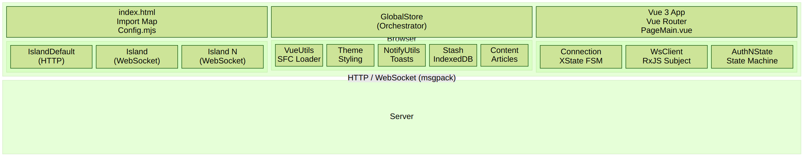
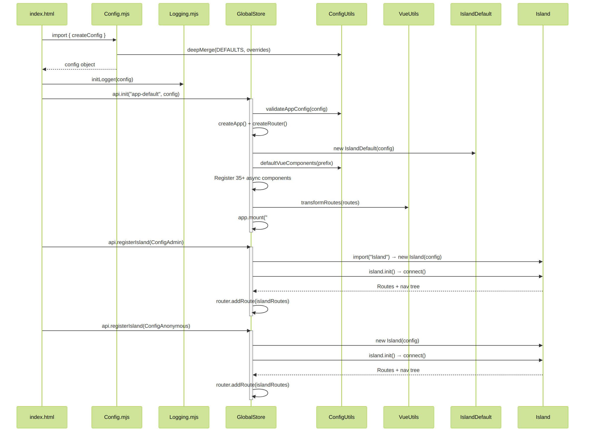
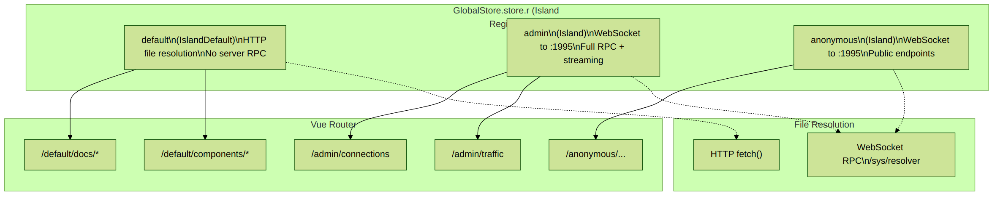
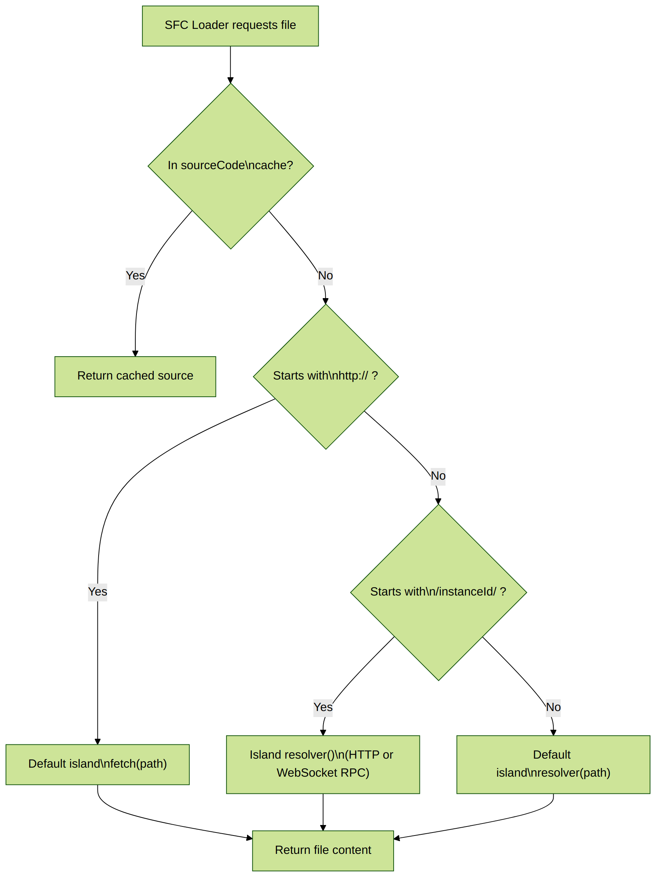
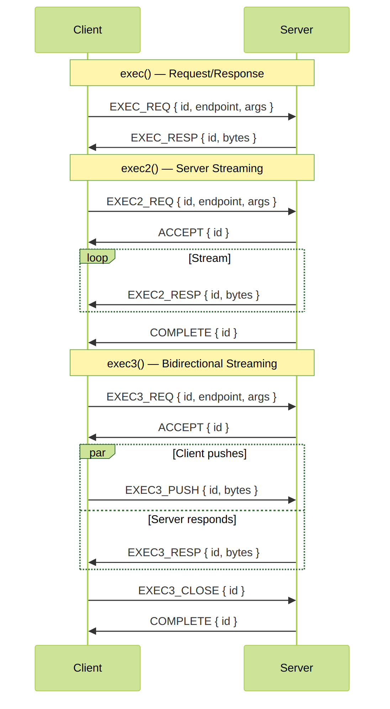
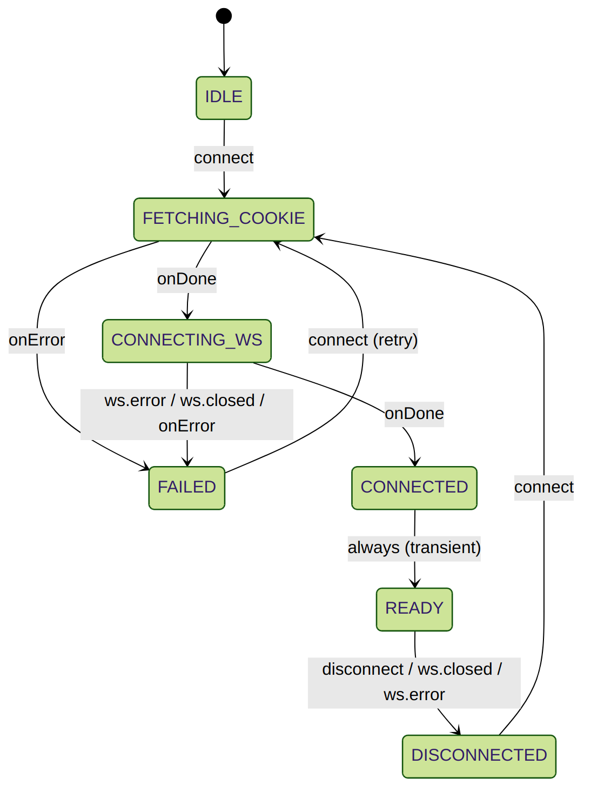
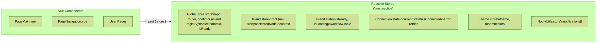
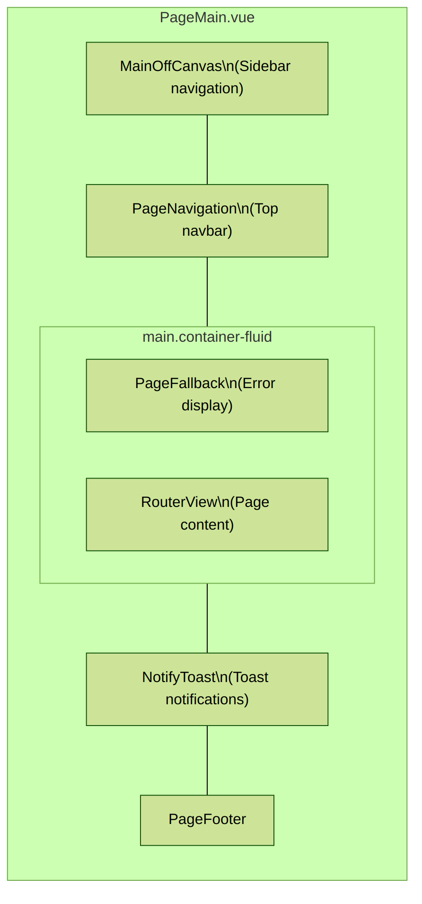
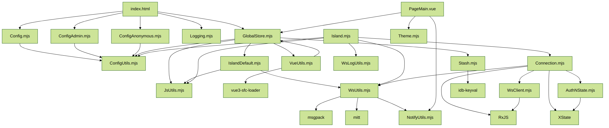

# Architecture

C0ckp1t is a zero-build Vue 3 framework that uses an **Islands Architecture** to connect a browser-based frontend to one or more backend services. All `.vue` Single File Components are compiled at runtime by [vue3-sfc-loader](https://github.com/FranckFreiburger/vue3-sfc-loader) -- no Webpack, Vite, or any build step is required. ES module [import maps](https://developer.mozilla.org/en-US/docs/Web/HTML/Element/script/type/importmap) provide bare specifier resolution directly in the browser.

This document covers the system architecture, module responsibilities, communication protocols, and key design patterns.

---

## Table of Contents

- [High-Level Architecture](#high-level-architecture)
- [Application Bootstrap Flow](#application-bootstrap-flow)
- [Islands Architecture](#islands-architecture)
- [Core Modules](#core-modules)
- [Runtime SFC Compilation](#runtime-sfc-compilation)
- [WebSocket Protocol](#websocket-protocol)
- [Connection Lifecycle](#connection-lifecycle)
- [State Management](#state-management)
- [Routing](#routing)
- [Component Library](#component-library)
- [Application Shell](#application-shell)
- [Module Dependency Graph](#module-dependency-graph)
- [Directory Structure](#directory-structure)

---

## High-Level Architecture

The system is organized in three layers: the **Browser** runtime, the **Framework Core**, and an optional **Server** backend.



**Key characteristics:**

- **Zero-build** -- No compilation step. The browser loads ES modules directly and compiles `.vue` files at runtime.
- **Import maps** -- Bare specifiers like `"vue"`, `"GlobalStore"`, `"rxjs"` are resolved to local files or CDN URLs via the HTML `<script type="importmap">`.
- **Islands** -- Each backend connection is an independent "island" with its own routes, state, and file resolver.
- **Binary protocol** -- WebSocket communication uses [MessagePack](https://msgpack.org/) for efficient binary serialization.

---

## Application Bootstrap Flow

The application starts from `index.html`, which loads CSS, defines the import map, and runs the bootstrap script:



**Step-by-step:**

1. **`index.html`** loads CSS (Bootstrap, FontAwesome, highlight.js, KaTeX) and defines the import map mapping bare specifiers to local files.
2. **`Config.mjs`** calls `createConfig()` which deep-merges user overrides with `DEFAULTS` from `ConfigUtils.mjs`.
3. **`Logging.mjs`** initializes `loglevel` with per-module log levels from config.
4. **`GlobalStore.api.init()`** bootstraps the Vue application:
   - Validates config via `validateAppConfig()`
   - Creates the Vue 3 app instance and Vue Router (hash mode by default)
   - Creates the "default" island (`IslandDefault`) for HTTP file resolution
   - Registers 35+ reusable components as global async components
   - Transforms route configs into lazy-loaded Vue Router routes
   - Mounts the app to the `#app-default` DOM element
5. **`api.registerIsland()`** is called for each WebSocket backend:
   - Dynamically imports the island class (e.g., `Island.mjs`)
   - Creates the island instance and calls `island.init()`
   - The island connects to the server, authenticates, and loads its route/nav tree
   - Dynamic routes are added to the router under `/${instanceId}/`

---

## Islands Architecture

C0ckp1t implements a variant of the **Islands Architecture** where each "island" represents an independent backend connection with its own routes, state, and capabilities.




### Two Island Types

| Type | Module | Protocol | File Resolution | RPC Execution |
|------|--------|----------|-----------------|---------------|
| **IslandDefault** | `core/IslandDefault.mjs` | HTTP only | `fetch(path)` | Not supported (`nok("[NOT_IMPLEMENTED]")`) |
| **Island** | `core/Island.mjs` | WebSocket + HTTP | WebSocket RPC via `/sys/resolver` | `exec()`, `exec2()`, `exec3()` |

### IslandDefault (HTTP)

The default island is always created during `api.init()`. It serves as the fallback file resolver for the SFC loader and provides basic HTTP methods (`getText`, `getJson`, `postJson`, `getBinary`). It cannot execute server-side commands.

### Island (WebSocket)

WebSocket islands provide full connectivity to a backend server:

- **Connection management** -- XState-driven lifecycle with automatic cookie authentication
- **File resolution** -- `.vue` files are resolved via WebSocket RPC (`/sys/resolver`), enabling the server to dynamically generate or transform components
- **RPC execution** -- Three execution patterns:
  - `exec(endpoint, args)` -- Request/response (returns `Promise<RPCResult>`)
  - `exec2(endpoint, args)` -- Server-streaming (returns `Observable`)
  - `exec3(endpoint, args)` -- Bidirectional streaming (returns `Observable`, supports `send()` and `close()`)
- **Node tree** -- The server provides a hierarchical navigation tree that defines the island's routes and sidebar structure

### Island Registration

Islands are registered via `api.registerIsland(config)`:

1. Config is validated (type, instanceId, connection params)
2. The island class is dynamically imported based on `config.type`
3. An island instance is created and stored in `store.r[instanceId]`
4. `island.init()` establishes the connection and loads the server's route/nav tree
5. Routes are dynamically added to the Vue Router under `/${instanceId}/`

---

## Core Modules

### Orchestration

| Module | File | Purpose |
|--------|------|---------|
| **GlobalStore** | `core/GlobalStore.mjs` | Central orchestrator. Creates the Vue app, router, island registry (`store.r`), and provides the public `api` for island registration, routing, and module loading. |
| **ConfigUtils** | `core/ConfigUtils.mjs` | Configuration backbone. Contains `DEFAULTS`, `validateAppConfig()`, `buildNavTree()`, `buildRoutes()`, `defaultVueComponents()`, and `deepMerge()`. |

### SFC Engine

| Module | File | Purpose |
|--------|------|---------|
| **VueUtils** | `core/VueUtils.mjs` | Configures `vue3-sfc-loader` with module cache, file resolver, and lazy-loading. Exports `loadModule()`, `loadModuleFromText()`, and `transformRoutes()`. |

### Islands

| Module | File | Purpose |
|--------|------|---------|
| **IslandDefault** | `core/IslandDefault.mjs` | HTTP-only island. Resolves files via `fetch()`, provides basic HTTP methods, no WebSocket. |
| **Island** | `core/Island.mjs` | WebSocket-backed island. Manages `Connection`, resolves files via WS RPC, implements `exec()`/`exec2()`/`exec3()`, and builds the server's node tree. |

### WebSocket Stack

| Module | File | Purpose |
|--------|------|---------|
| **WsUtils** | `core/WsUtils.mjs` | Protocol definitions (`Code`, `Code2`), msgpack serialization (`toBinary`/`fromBinary`), `RPCResult` helpers (`ok`/`nok`), `Http` client, and `mitt` event bus. |
| **WsClient** | `core/ws-client/WsClient.mjs` | RxJS `WebSocketSubject` wrapper. Handles binary msgpack communication, ID-keyed message routing via subscriptions, and status observables. |
| **Connection** | `core/ws-client/Connection.mjs` | XState-driven connection manager. Orchestrates the auth flow (cookie fetch -> WS connect -> ready), manages `WsClient` lifecycle, and provides `execute()`/`execute2()`/`execute3()`. |
| **AuthNState** | `core/ws-client/AuthNState.mjs` | XState v5 state machine definition for the connection lifecycle. Defines states, transitions, and error handling for authentication. |
| **WsLogUtils** | `core/WsLogUtils.mjs` | WebSocket traffic logger. Circular buffer (50 entries) recording exec/exec2 packets with timing, endpoint, args, and response codes. |

### Utilities

| Module | File | Purpose |
|--------|------|---------|
| **JsUtils** | `core/JsUtils.mjs` | General utilities: SHA256/SHA1 hashing, string operations (`kebabCase`, `capitalize`, `ellipsis`), sorting, date formatting, `sleep()`, `uid()`, path manipulation. |
| **Logging** | `core/Logging.mjs` | Logging facade wrapping `loglevel` with `loglevel-plugin-prefix`. Per-module log level configuration. |
| **Theme** | `core/Theme.mjs` | Dynamic theming engine. CSS variable overrides, 27+ Bootswatch themes, light/dark mode toggle, custom color editor. |
| **Stash** | `core/Stash.mjs` | IndexedDB key-value store via `idb-keyval`. Isolated databases per store name (`c0ckp1t-${name}`). |
| **Content** | `core/Content.mjs` | Article/content management. Loads articles from server, caches in IndexedDB with SHA1-based invalidation. |
| **NotifyUtils** | `core/notify/NotifyUtils.mjs` | Notification queue. Reactive notification list with GOOD/BAD/INFO types, auto-dismiss timers. |

---

## Runtime SFC Compilation

The zero-build architecture relies on `vue3-sfc-loader` to compile `.vue` files in the browser. The `VueUtils.mjs` module configures this with a custom resolver, module cache, and lazy-loading system.

### File Resolution Strategy

When the SFC loader needs a file, it calls `options.getFile(path)` which uses a 3-tier resolution strategy:



### Module Cache and Lazy Loading

The `moduleCache` is pre-seeded with all framework modules so any `.vue` SFC can import them by bare specifier:

```javascript
// These are available in any SFC without configuration:
import { store, api } from "GlobalStore";
import { ok, nok } from "WsUtils";
import { reactive } from "vue";
```

Heavy libraries are lazy-loaded using `Object.defineProperty` getters on the module cache. They are only fetched when an SFC actually imports them:

| Library | Loaded When |
|---------|-------------|
| `rxjs`, `rxjs/operators` | An SFC imports RxJS |
| `xstate` | An SFC imports XState |
| `mitt` | An SFC imports mitt |
| `idb-keyval` | An SFC imports idb-keyval |
| `wavesurfer` | The `<x-sound>` component is used |
| `msgpack` | Binary serialization is needed |

### How SFC Loading Works

1. A route is navigated to, triggering `() => loadModule("/path/to/Component.vue")`
2. `vue3-sfc-loader` calls `getFile(path)` to fetch the `.vue` source
3. The resolver determines which island handles the path and fetches accordingly
4. The `<template>`, `<script>`, and `<style>` blocks are compiled in-browser
5. The resulting component is cached in `moduleCache` to avoid recompilation
6. `<style>` blocks are injected into `document.head`

### Loading SFCs from Strings

`loadModuleFromText(sfcText, name)` compiles raw SFC strings without network fetches. This enables server-pushed or user-authored components to be compiled on the fly using virtual paths (`virtual://${name}.vue`).

---

## WebSocket Protocol

WebSocket communication uses a binary MessagePack protocol with typed packet codes.

### Packet Structure

```javascript
{
  id:       number,    // Random 32-bit integer, correlates request/response
  code:     string,    // Packet type (Code2 enum)
  endpoint: string,    // Server endpoint path (e.g., "/sys/resolver")
  args:     Array,     // Endpoint arguments
  bytes:    Uint8Array // MessagePack-encoded payload (nullable)
}
```

### Packet Codes (Code2)

| Code | Direction | Purpose |
|------|-----------|---------|
| `EXEC_REQ` | Client -> Server | Request/response RPC call |
| `EXEC_RESP` | Server -> Client | Response to `EXEC_REQ` |
| `EXEC2_REQ` | Client -> Server | Start a streaming RPC |
| `EXEC2_RESP` | Server -> Client | Stream data packet |
| `EXEC3_REQ` | Client -> Server | Start bidirectional stream |
| `EXEC3_PUSH` | Client -> Server | Push data to open stream |
| `EXEC3_RESP` | Server -> Client | Stream response data |
| `EXEC3_CLOSE` | Client -> Server | Close the stream |
| `ACCEPT` | Server -> Client | Stream accepted |
| `COMPLETE` | Server -> Client | Stream completed |
| `EVENT` | Server -> Client | Server-pushed event |
| `ERROR` | Server -> Client | Error response |

### RPC Patterns



### RPCResult Envelope

All `exec()` responses use a standard envelope:

```javascript
// Success
{ isOk: true,  result: <data> }

// Failure
{ isOk: false, result: <error message>, stack: [...] }
```

Created via the `ok()` and `nok()` helper functions from `WsUtils.mjs`.

### exec2 Stream Deserialization

`Island.exec2Result()` pipes `exec2()` through a mapper that deserializes binary packets into structured objects:

| Type | Meaning |
|------|---------|
| `START` | Stream started |
| `END` | Stream ended |
| `STDOUT` | Standard output data |
| `STDERR` | Standard error data |
| `STDIELD` | Structured data (yield) |

---

## Connection Lifecycle

Each WebSocket island manages its connection through an XState state machine defined in `AuthNState.mjs`. The `Connection` class (`Connection.mjs`) drives this machine and syncs state to Vue reactivity.



### Connection States

| State | Description |
|-------|-------------|
| **IDLE** | Initial state. Waiting for `connect` event. |
| **FETCHING_COOKIE** | POSTs session metadata (uniqueId, password, user agent, screen size) to `http(s)://<host>:<port>/cookie` to establish a session cookie. 10-second timeout. |
| **CONNECTING_WS** | Opens a WebSocket to `ws(s)://<host>:<port>/<endpoint>?connectionId=<instanceId>` via `WsClient`. 10-second timeout. |
| **CONNECTED** | Transient state, immediately transitions to READY. |
| **READY** | Fully connected and authenticated. RPC calls are available. The island loads its node tree and user context. |
| **DISCONNECTED** | Connection was closed (clean or not). Can reconnect via `connect`. |
| **FAILED** | Error occurred during cookie fetch or WS connect. Error details stored in `context.error`. Can retry via `connect` (increments retry counter). |

### Connection Components

| Component | File | Role |
|-----------|------|------|
| **Connection** | `core/ws-client/Connection.mjs` | Manages the XState actor, provides `connect()`/`disconnect()`, and implements `execute()`/`execute2()`/`execute3()` RPC methods. |
| **WsClient** | `core/ws-client/WsClient.mjs` | Low-level RxJS `WebSocketSubject` wrapper. Routes incoming packets by `id` to the correct subscriber. Handles binary msgpack deserialization. |
| **AuthNState** | `core/ws-client/AuthNState.mjs` | Pure XState state machine definition. Defines states, transitions, and error assignment actions. |

---

## State Management

C0ckp1t uses a **distributed reactive store** pattern instead of Vuex or Pinia. Each module exports a `{ store, api }` pair:

- **`store`** -- A `Vue.reactive({})` object holding the module's state
- **`api`** -- A plain object with methods that read/mutate the store



### Why Not Vuex/Pinia?

This is a deliberate design decision aligned with the zero-build philosophy. Since there is no build step, the framework avoids any tool that requires compile-time plugins or transformations. `Vue.reactive()` provides the same reactivity guarantees without additional dependencies.

### Store Pattern

```javascript
// In a module (e.g., NotifyUtils.mjs):
export const store = reactive({ notifications: [] });
export const api = {
  good(msg) { store.notifications.push({ type: "GOOD", msg }); },
  bad(msg)  { store.notifications.push({ type: "BAD", msg }); },
};

// In a component:
import { store, api } from "NotifyUtils";
// store.notifications is reactive — templates auto-update
// api.good("Success!") adds a notification
```

---

## Routing

Vue Router is configured in hash mode by default (`createWebHashHistory()`), configurable via `config.vueRouterModeIsHash`.

### Route Sources

Routes come from three sources:

1. **Default routes** (`ConfigUtils.buildRoutes()`) -- Documentation, connections, cache, traffic, notifies, component showcase, and 404 catch-all.
2. **Config routes** (`config.routes`) -- User-defined routes in the application config.
3. **Island routes** (`api.insertRoutes()`) -- Dynamically added when an island connects and provides its navigation tree from the server.

### Lazy-Loaded Route Components

All route components are lazy-loaded and compiled on demand via `transformRoutes()`:

```javascript
// Config format:
{ path: "/docs", location: "/core/pages/Documentation.vue" }

// Transformed to Vue Router format:
{ path: "/docs", component: () => loadModule("/core/pages/Documentation.vue") }
```

The `.vue` file is only fetched and compiled when the user first navigates to that route.

### Dynamic Route Insertion

When a WebSocket island connects, it loads a route configuration from the server (via `/sys/resolver`) and dynamically adds routes using `router.addRoute()`. Each island's routes are namespaced under `/${instanceId}/`:

```
/default/docs/Introduction.md   → Documentation.vue (default island)
/admin/connections               → Connections.vue (admin island)
/anonymous/public/dashboard      → Dashboard.vue (anonymous island)
```

---

## Component Library

C0ckp1t includes 35+ reusable Vue components globally registered as async components. All use Bootstrap 5 styling and support `v-model` where applicable.

### Component Categories

**Form Inputs:** `<x-input>`, `<x-input2>`, `<x-textarea>`, `<x-checkbox>`, `<x-dropdown>`, `<x-dropdown2>`, `<x-color>`, `<x-upload>`, `<x-hidden>`

**Buttons & Toggles:** `<x-button>`, `<ExecButton>`, `<x-check>`, `<x-toggle>`, `<x-toggle3>`

**Data Display:** `<x-label>`, `<x-kv>`, `<x-json>`, `<x-table-open>`, `<x-code>`, `<x-code-slot>`

**Layout & Structure:** `<x-card>`, `<x-card-h>`, `<x-section>`, `<x-collapse>`, `<x-tabs>`, `<x-nav>`

**Advanced:** `<x-markdown>` (markdown-it), `<x-terminal>` (Ace-based terminal), `<x-sound>` (WaveSurfer audio player), `<x-tree>` (recursive tree view), `<FsTree>` (filesystem browser), `<vue3-ace-editor>` (code editor), `<code-mirror>` (CodeMirror 6 editor)

### Naming Convention

- Reusable components use the `x-` prefix in templates (e.g., `<x-input>`)
- Component files use the `x` prefix without hyphen (e.g., `xinput.vue`)
- Non-prefixed components are standalone utilities (e.g., `ExecButton.vue`, `FsTree.vue`)

### Registration

Components are registered in `GlobalStore.api.init()` via `defineAsyncComponent()`:

```javascript
app.component("x-input", defineAsyncComponent(() => loadModule("/components/xinput.vue")));
```

Components are only fetched and compiled when first rendered in a template.

---

## Application Shell

`PageMain.vue` is the root component mounted as `<app-main>`. It provides the application layout:




**Key behaviors:**

- **Theme switching** -- Watches `Theme.store.theme` and applies `data-bs-theme` attribute to `<html>` for Bootstrap dark/light mode.
- **Error capture** -- `onErrorCaptured` catches all child component errors and pushes them to `store.componentErrors`, displayed by `PageFallback`.
- **Responsive sidebar** -- When the sidebar is open, `mainContentStyle` shifts the main content area (margin and width adjustments).

### Sidebar (MainOffCanvas)

The sidebar (`main-offcanvas.vue`) uses Bootstrap's offcanvas component and displays:
- The island registry with connection status
- Recursive node trees for each connected island
- Navigation to island-specific pages

### Navigation (PageNavigation)

The top navbar (`PageNavigation.vue`) includes:
- Brand/logo with animated logo component
- Navigation items from config
- Theme toggle (light/dark mode)
- Search functionality

---

## Module Dependency Graph



---

## Directory Structure

```
c0ckp1t-webroot/
├── index.html                  # Main entry point (local modules)
├── index-cdn.html              # CDN entry point (jsdelivr)
├── Config.mjs                  # App config factory (createConfig)
├── ConfigAdmin.mjs             # Admin WebSocket island config
├── ConfigAnonymous.mjs         # Anonymous WebSocket island config
├── package.json                # npm package (v1.0.19)
├── style.css                   # Global styles
│
├── core/                       # Framework core
│   ├── GlobalStore.mjs         # Central orchestrator
│   ├── VueUtils.mjs            # Runtime SFC compiler config
│   ├── ConfigUtils.mjs         # Defaults, validation, route/nav building
│   ├── Island.mjs              # WebSocket island class
│   ├── IslandDefault.mjs       # HTTP-only island class
│   ├── WsUtils.mjs             # Protocol, serialization, HTTP client
│   ├── JsUtils.mjs             # General utilities
│   ├── WsLogUtils.mjs          # WebSocket traffic logger
│   ├── Logging.mjs             # Logging facade (loglevel)
│   ├── Theme.mjs               # Dynamic theming engine
│   ├── Content.mjs             # Article management + IndexedDB cache
│   ├── Stash.mjs               # IndexedDB key-value store
│   ├── PageMain.vue            # Root app shell
│   ├── PageNavigation.vue      # Top navbar
│   ├── PageFooter.vue          # Footer
│   ├── PageFallback.vue        # Error display
│   ├── Page404.vue             # 404 page
│   ├── LogoAnimated.vue        # Animated logo SVG
│   ├── main-offcanvas.vue      # Sidebar navigation
│   │
│   ├── ws-client/              # WebSocket client stack
│   │   ├── WsClient.mjs        # RxJS WebSocketSubject wrapper
│   │   ├── Connection.mjs      # XState-driven connection manager
│   │   └── AuthNState.mjs      # State machine definition
│   │
│   ├── notify/                 # Notification system
│   │   ├── NotifyUtils.mjs     # Notification queue + API
│   │   └── toast.vue           # Toast display component
│   │
│   ├── nodes/                  # Sidebar node tree components
│   │   ├── node.vue            # Recursive tree node
│   │   ├── node-container.vue  # Node content wrapper
│   │   ├── root.vue            # Root node display
│   │   ├── place-holder.vue    # Default placeholder
│   │   └── _api.vue            # API node inspector
│   │
│   ├── sfc/                    # SFC helper components
│   │   ├── code-item.vue       # Code viewer (default registry)
│   │   ├── code-item2.vue      # Code viewer (provide/inject)
│   │   ├── scroll-to-top.vue   # Scroll-to-top button
│   │   ├── md-toc.vue          # Markdown table of contents
│   │   ├── toc-list.vue        # Recursive TOC renderer
│   │   ├── task.vue            # Task/event display
│   │   └── info-api.vue        # API endpoint inspector
│   │
│   └── pages/                  # Built-in framework pages
│       ├── Documentation.vue   # Markdown documentation viewer
│       ├── Connections.vue     # Connection list/management
│       ├── Connection.vue      # Single connection detail
│       ├── Cache.vue           # Cache management
│       ├── Traffic.vue         # WebSocket traffic viewer
│       ├── Notifies.vue        # Notification history
│       ├── About.vue           # About/system info
│       ├── connections/        # Connection sub-pages
│       └── frontend/           # Component showcase pages
│
├── components/                 # 35+ reusable Vue components
│   ├── xinput.vue              # Text input
│   ├── xbutton.vue             # Button with spinner
│   ├── xcard.vue               # Card layout
│   ├── xmarkdown.vue           # Markdown renderer
│   ├── xterminal.vue           # Terminal emulator
│   ├── vue3-ace-editor.vue     # Ace editor wrapper
│   ├── code-mirror.vue         # CodeMirror 6 wrapper
│   ├── ...                     # (see Component Library section)
│   ├── MarkdownUtils.mjs       # Markdown-it configuration
│   ├── Tree.mjs                # Tree data utilities
│   └── AceLoader.mjs           # Ace editor lazy loader
│
├── css/                        # Stylesheets
│   ├── bootstrap.min.css       # Bootstrap 5
│   ├── bootstrap-c0ckp1t.css   # Custom overrides
│   ├── fontawesome/            # FontAwesome CSS
│   └── webfonts/               # Font files
│
├── js_ext/                     # Vendored JS libraries (no npm install)
│   ├── vue.esm-browser.prod.min.js
│   ├── vue-router.esm-browser.prod.js
│   ├── vue3-sfc-loader.esm.js
│   ├── rxjs.esm.mjs            # RxJS
│   ├── xstate.web.mjs          # XState
│   ├── msgpack.mjs             # MessagePack
│   ├── mitt.mjs                # Event emitter
│   ├── idb-keyval-6.2.2.mjs    # IndexedDB wrapper
│   ├── highlight/              # Highlight.js + languages
│   ├── ace-editor/             # Ace editor + modes/themes
│   └── markdown/               # markdown-it + plugins
│
├── examples/                   # Example projects
│   ├── minimum/                # Minimal starter
│   ├── blog/                   # Blog example
│   ├── galore/                 # Feature showcase
│   ├── landing-page/           # Landing page examples
│   └── c0ckp1t-demo/           # Full demo app
│
├── tests/                      # Unit tests (Vitest)
│   └── src/
│       └── JsUtils.test.mjs    # Utility function tests
│
├── c0ckp1t-server/             # Development server
│   └── src/
│       ├── c0ckp1t-server.mjs  # Express + CLI (commander)
│       └── WsServer.mjs        # WebSocket server
│
└── docs/                       # Documentation
    ├── Introduction.md
    ├── Architecture.md         # (this document)
    ├── Getting-Started.md
    ├── Configuration.md
    ├── Creating-SFC.md
    ├── Components.md
    ├── Theming.md
    └── Articles/               # Deep-dive articles
```

---

## External Dependencies

All external libraries are vendored in `js_ext/` -- no `npm install` is needed for the frontend.

| Library | Purpose |
|---------|---------|
| **Vue 3** | Reactive UI framework |
| **Vue Router** | Client-side routing |
| **vue3-sfc-loader** | Runtime `.vue` file compiler |
| **RxJS** | Reactive WebSocket streams |
| **XState** | Connection state machine |
| **MessagePack** | Binary WebSocket serialization |
| **mitt** | Event bus |
| **idb-keyval** | IndexedDB key-value store |
| **Bootstrap 5** | CSS framework + JS components |
| **FontAwesome** | Icon library |
| **highlight.js** | Code syntax highlighting |
| **Ace Editor** | Code editor |
| **CodeMirror 6** | Code editor (alternative) |
| **markdown-it** | Markdown rendering |
| **KaTeX** | LaTeX math rendering |
| **WaveSurfer.js** | Audio waveform visualization |
| **loglevel** | Logging with level control |
| **Moment.js** | Date formatting |
